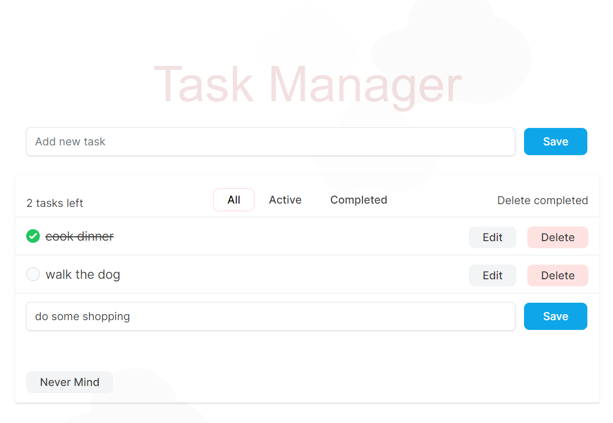

# Taskify

<p>Taskify is a task management application. It has the Model-View-Controller (MVC) architecture and allows you to Create, Read, Update and Delete tasks.</p>
<p>In addition, it implements filtering of tasks based on their completion status. </p>
<p>Each task includes a "Toggle" feature that allows you to mark the task as complete or incomplete.</p>

## App Screenshot



## Technologies

<ul>
    <li>Ruby 3.1.3</li>
    <li>Rails</li> 
    <li>SQLite3</li>
    <li>Stimulus</li>
    <li>Turbo</li>    
    <li>TailwindCSS</li>          
</ul>

## Installing the Gems

```bash
$ bundle install
```

## Running the App

```bash
$ rails s
```